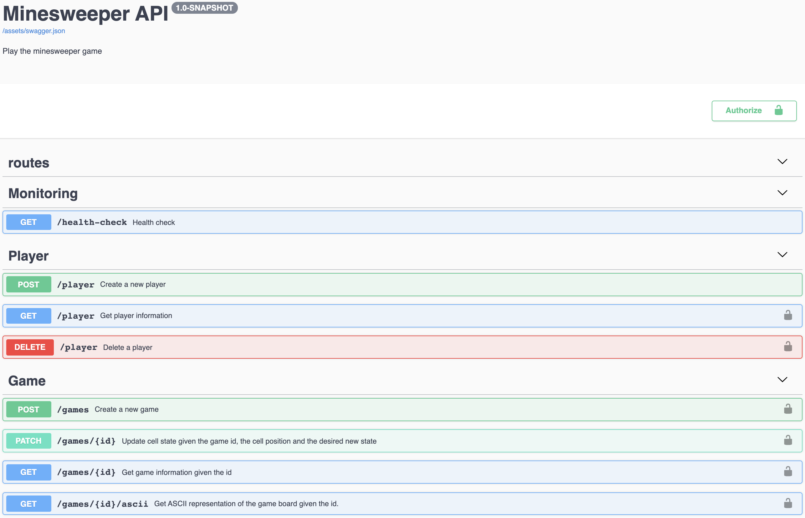
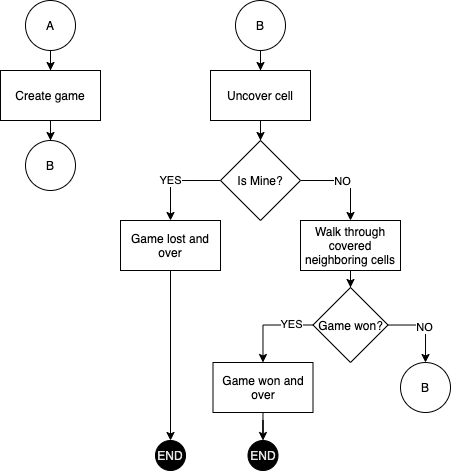

# minesweeper-API
API for Minesweeper game

The development is guided by the following instructions: [INSTRUCTIONS.md](INSTRUCTIONS.md)

## Dependencies:
- [Scala] v2.13.x
- [Play framework] v2.8.x

## API

This app uses Basic Access Authentication. More info at https://en.wikipedia.org/wiki/Basic_access_authentication

**You can explore the Swagger UI:**



- At localhost:

http://localhost:9000/docs/swagger-ui/index.html?url=/assets/swagger.json#/

- At production:

TBD

**Or pick a curl:**

* **/health-check**

````shell script
curl -X GET http://localhost:9000/health-check
````

* **/players**

**Create:**

````shell script
curl --request POST \
  --url http://localhost:9000/player \
  --header 'Content-Type: application/json' \
  --data '{
	"username": "<username>",
	"password": "<password>"
}'
````

**Get by ID:**

````shell script
curl --request GET \
  --url http://localhost:9000/player \
  --header 'Authorization: Basic <credentials>'
````

**Delete by ID:**

````shell script
curl --request DELETE \
  --url http://localhost:9000/player/2 \
  --header 'Authorization: Basic <credentials>'
````

* **/games**

**Create a new one:**

````shell script
curl --request POST \
  --url http://localhost:9000/games \
  --header 'Content-Type: application/json' \
  --header 'Authorization: Basic <credentials>' \
  --data '{
	"playerId": 1,
	"height": 10,
	"width": 10,
	"mines": 4
}'
````

**Get by ID:**

````shell script
curl --request GET \
  --url http://localhost:9000/games/1 \
  --header 'Authorization: Basic <credentials>'
````

**Reveal a cell:**

````shell script
curl --request PATCH \
  --url http://localhost:9000/games/1 \
  --header 'Content-Type: application/json' \
  --header 'Authorization: Basic <credentials>' \ 
  --data '{
	"action": "reveal",
	"position": {
		"x": 8,
		"y": 10
	}
}'
````

**Set a question flag:**

````shell script
curl --request PATCH \
  --url http://localhost:9000/games/1 \
  --header 'Content-Type: application/json' \
  --header 'Authorization: Basic <credentials>' \ 
  --data '{
	"action": "set-question-flag",
	"position": {
		"x": 8,
		"y": 10
	}
}'
````

**Set a red flag:**

````shell script
curl --request PATCH \
  --url http://localhost:9000/games/1 \
  --header 'Content-Type: application/json' \
  --header 'Authorization: Basic <credentials>' \ 
  --data '{
	"action": "set-red-flag",
	"position": {
		"x": 8,
		"y": 10
	}
}'
````

**Clean a cell:**

````shell script
curl --request PATCH \
  --url http://localhost:9000/games/1 \
  --header 'Content-Type: application/json' \
  --header 'Authorization: Basic <credentials>' \ 
  --data '{
	"action": "clean",
	"position": {
		"x": 8,
		"y": 10
	}
}'
````

## Development process

### Unit tests

````sbtshell
sbt clean test
````

### Run in Dev mode

````sbtshell
sbt clean run
````

### Coverage

````sbtshell
sbt clean coverage test coverageReport
````

## Release and Deployment process

````shell script
./release.sh 0.0.1
./deploy.sh 0.0.1
````

## TODO list

1. [x] Initial Setup
2. [x] Release and Deployment process
3. [ ] Core functionalities (listed below)
4. [ ] Authentication and Authorization
5. [ ] Functional tests
6. [x] Doc + Swagger
7. [ ] Contextual logging
8. [ ] Metrics
9. [ ] Tracing
10. [ ] Playground with a docker compose
11. [ ] Architecture decision record

**Note:** the goal is to cover the first 6 points within the next week
to get an productive MVP with the functionalities required.

### Core functionalities

- [x] Design and implement a documented RESTful API for the game (think of a mobile app for your API)
- [ ] Implement an API client library for the API designed above. Ideally, in a different language, of your preference, to the one used for the API
- [x] When a cell with no adjacent mines is revealed, all adjacent squares will be revealed (and repeat)
- [ ] Ability to 'flag' a cell with a question mark or red flag
- [x] Detect when game is over
- [x] Persistence
- [x] Time tracking
- [x] Ability to start a new game and preserve/resume the old ones
- [x] Ability to select the game parameters: number of rows, columns, and mines
- [x] Ability to support multiple users/accounts

### Basic functional flow



[Scala]: https://www.scala-lang.org/
[Play framework]: https://www.playframework.com/
