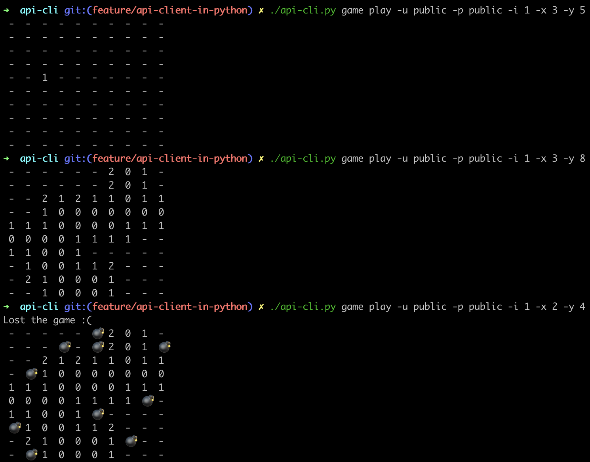

# minesweeper-cli to play Minesweeper via terminal
`minesweeper-cli` is a user-friendly command-line interface to play the Minesweeper.

### Examples:
```bash
# create user public with password public
./minesweeper-cli.py user -a new -u public -p public

# create game with height 10, width 10 and 10 mines
./minesweeper-cli.py game new -u public -p public -he 10 -w 10 -m 10

# draw the board for game ID 1
./minesweeper-cli.py game draw -u public -p public -i 1

# draw the board for game ID 1 showing the mines
./minesweeper-cli.py game draw -u public -p public -i 1 --debug

# reveal cell (x: 3, y: 5) for game ID 1
./minesweeper-cli.py game play -u public -p public -i 1 -x 3 -y 5

# add question flag on cell (x: 2, y: 9) for game ID 2
./minesweeper-cli.py game play -u public -p public -a add-question-flag -i 2 -x 2 -y 9

# add red flag on cell (x: 2, y: 9) for game ID 2
./minesweeper-cli.py game play -u public -p public -a add-red-flag -i 2 -x 2 -y 9

# clean cell (x: 2, y: 9) for game ID 2
./minesweeper-cli.py game play -u public -p public -a clean -i 2 -x 2 -y 9
```

### Example in pictures



### Usage

```shell script
usage: minesweeper-cli.py [-h] {user,game} ...

Minesweeper game

positional arguments:
  {user,game}  game commands help
    user       User management
    game       Play a game

optional arguments:
  -h, --help   show this help message and exit

```

**sub-command user:**

```shell script
usage: minesweeper-cli.py user [-h] [--action [{new,details,delete}]] --user USER --password PASSWORD

optional arguments:
  -h, --help            show this help message and exit
  --action [{new,details,delete}], -a [{new,details,delete}]
                        Action. Default: details
  --user USER, -u USER  Username
  --password PASSWORD, -p PASSWORD
                        Password
```

**sub-command game:**

```shell script
usage: minesweeper-cli.py game [-h] {new,play,draw} ...

positional arguments:
  {new,play,draw}  play actions help
    new            New game
    play           Play game
    draw           Draw the game

optional arguments:
  -h, --help       show this help message and exit
```

**sub-command game new:**

```shell script
usage: minesweeper-cli.py game new [-h] [--height HEIGHT] [--width WIDTH] [--mines MINES] --user USER --password PASSWORD

optional arguments:
  -h, --help            show this help message and exit
  --height HEIGHT, -he HEIGHT
                        Height. Default: 10
  --width WIDTH, -w WIDTH
                        Width. Default: 10
  --mines MINES, -m MINES
                        Number of mines. Default: 10
  --user USER, -u USER  Username
  --password PASSWORD, -p PASSWORD
                        Password
```

**sub-command game play:**

```shell script
usage: minesweeper-cli.py game play [-h] -x X -y Y --id GAME_ID [--debug] [--action [{reveal,add-red-flag,add-question-flag,clean}]] --user USER --password PASSWORD

optional arguments:
  -h, --help            show this help message and exit
  -x X                  X position
  -y Y                  Y position
  --id GAME_ID, -i GAME_ID
                        Game ID
  --debug               Show mines in the board
  --action [{reveal,add-red-flag,add-question-flag,clean}], -a [{reveal,add-red-flag,add-question-flag,clean}]
                        Action. Default: reveal
  --user USER, -u USER  Username
  --password PASSWORD, -p PASSWORD
                        Password
```

**sub-command game draw:**

```shell script
usage: minesweeper-cli.py game draw [-h] --id GAME_ID [--debug] --user USER --password PASSWORD

optional arguments:
  -h, --help            show this help message and exit
  --id GAME_ID, -i GAME_ID
                        Game ID
  --debug               Show mines in the board
  --user USER, -u USER  Username
  --password PASSWORD, -p PASSWORD
                        Password
```
